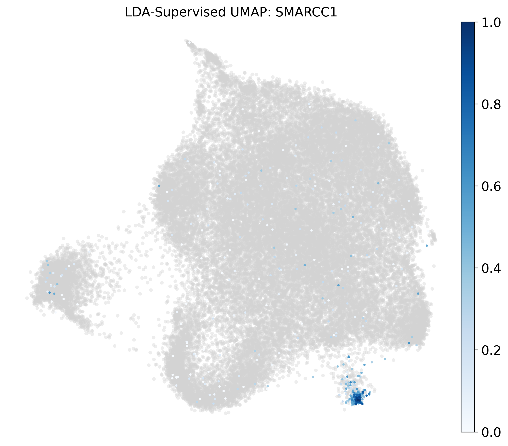

# Perturbation Analysis 

A Python pipeline for quantifying and visualizing transcription factor (TF) perturbation efficiency in single-cell CRISPR screen (Perturb-seq) data. The pipeline computes per-cell **Perturbation Scores (PS)** using a translated scMAGeCK EM algorithm, projects cells onto a shared LDA-based UMAP, and generates diagnostic scatter plots for 50 target TFs.This PS score is inspired from R version. 

---

## Repository Structure

```
Petrubation_analysis/
├── README.md        # This file
└── demo/            # All analysis code, data, and example outputs (see below)
```

---

## The `demo/` Folder

The `demo/` folder contains everything needed to run the full perturbation analysis pipeline end-to-end. Here is what it includes and what each piece does:

### Input Data

| File | Description |
|------|-------------|
| `PertTF_Subset_100MB.h5ad` | AnnData object with 15,000 single cells and a full gene expression matrix (gzip-compressed, ~100 MB). This is the primary input to the pipeline. |
| `BARCODE_10x_Merged.txt` | Tab-separated file mapping each cell barcode to its CRISPR perturbation target gene. The `cell` column contains barcodes; the `gene` column contains the target gene name. Library prefixes (e.g. `S1L1_`, `S2L2_`) are stripped automatically at runtime. |

### Scripts

| File | Description |
|------|-------------|
| `PertPS.py` | **Main analysis pipeline.** Loads the AnnData and barcode table, maps barcodes to perturbation identities, computes a Perturbation Score (PS) for each of the 50 target TFs via an EM algorithm (adapted from scMAGeCK), trains a global LDA model to produce a shared UMAP embedding, and generates all output plots and score tables. |

### `pertps_project/`

The local Python package that `PertPS.py` imports. It provides:
- `PerturbAnalyzer` — the core class that runs the EM-based PS score calculation and LDA training.
- `plot_ps_on_lda` — renders per-gene PS scores overlaid on the shared LDA UMAP.
- `plot_global_summary` — renders a global UMAP highlighting all high-confidence knockdown cells (PS > 0.8).

Install it before running the pipeline:
```bash
pip install -e demo/pertps_project/
```

You can directly call as seen inside the PertPS.py file
### Example Validation Plots

Three example output plots are included to show what a successful knockdown looks like on the fixed LDA UMAP:

| File | Gene |
|------|------|
| `CTNNB1_Fixed_LDA.png` | CTNNB1 — Wnt pathway transcription factor |
| `EZH2_Fixed_LDA.png` | EZH2 — PRC2 complex histone methyltransferase |
| `SMARCC1_Fixed_LDA.png` | SMARCC1 — SWI/SNF chromatin remodeling complex subunit |

---

## Background

This project analyzes a 10x Genomics CRISPR perturbation screen targeting 50 transcription factors involved in chromatin regulation and pluripotency. For each target gene, the pipeline:

1. Maps cell barcodes to their assigned perturbation (knockdown) identity.
2. Computes a **Perturbation Score (PS)** — a per-cell probability (0–1) that a guide RNA successfully knocked down the target gene, estimated via an EM algorithm adapted from scMAGeCK.
3. Trains a **Linear Discriminant Analysis (LDA)** model on perturbed cells to build a shared low-dimensional embedding.
4. Visualizes PS scores overlaid on the fixed LDA UMAP.
5. Generates **quadrant scatter plots** (PS Score vs. Expression) to classify cells into biological categories.

---

## Target Genes (50 TFs)

The below are the list , you can have your own list or set of files that you are interested to examine
```
SMARCC1  TCF7L2   HMGA2    AFF4     HIF1A    TCF7L1   SMARCA4  CTNNB1
NFIB     TCF12    SMAD3    EZH2     REST     HDAC1    ARID1B   SMARCB1
CREBBP   SALL4    SMAD4    SUZ12    SMARCD2  ARID1A   ARNT     EP300
CLOCK    JARID2   SMARCD1  KLF6     SMARCC2  SOX2     PAX5     POU5F1
EED      TCF7     SMARCA2  BATF     SMARCD3  OR2F1    ESRRB    OR2AG2
NANOG    KLF4     OR2D3    TFCP2L1  OR2A25   OR6A2    TBX3     LEF1
RUNX1    MYC
```

---

## Dependencies

```bash
pip install scanpy anndata pandas numpy matplotlib seaborn tqdm scipy
pip install -e demo/pertps_project/
```

---

## Usage

Run the pipeline from inside the `demo/` folder:

```bash
cd demo
python PertPS.py
```

The script will:

1. Load `PertTF_Subset_100MB.h5ad` and `BARCODE_10x_Merged.txt`.
2. Strip library prefixes and map barcodes to target gene identities.
3. Compute PS scores for all 50 TFs and store them in `adata.obs` (e.g. `CTNNB1_eff`).
4. Save per-gene score tables to `tables_batch/<GENE>_PS_Scores.csv` (created automatically).
5. Train the global LDA model and generate UMAP coordinates.
6. Save fixed-LDA overlay plots to `plots_fixed_lda/`.
7. Save labeled diagnostic scatter plots to `plots_scatter_validation/`.

---

## Output Description

### `plots_fixed_lda/` (generated | not shown here due to size)
UMAP plots with PS scores overlaid on a shared LDA embedding trained on all perturbed cells. A global summary plot highlights high-confidence knockdown cells (PS > 0.8).

### `plots_scatter_validation/` (generated | not shown here due to size)
Labeled quadrant scatter plots (Perturbation Score vs. normalized target gene expression) for each TF. Cells are classified into four quadrants:

| Quadrant | Interpretation |
|----------|----------------|
| Top-right (High PS, High Expr) | **Escapers** — guide likely failed; gene still expressed |
| Bottom-right (High PS, Low Expr) | **Successful KD** — knockdown confirmed |
| Top-left (Low PS, High Expr) | **Control / WT** — unperturbed cells |
| Bottom-left (Low PS, Low Expr) | **Low Signal** — ambiguous / low-quality cells |

---

## Example Validation Plots

### CTNNB1


### EZH2


### SMARCC1


## Notes

- The pipeline handles non-unique cell barcodes automatically via `obs_names_make_unique()`.
- Library prefix stripping (`S1L1_`, `S1L2_`, `S2L1_`, `S2L2_`, etc.) is done by splitting on `_` and taking the last token.
- Background cells in scatter plots are downsampled to 2,000 for visual clarity; the PS boundary threshold is 0.5.
- The negative control population is labeled `"Non-Targeting"` in the barcode table.
- For better result please use the complete h5ad file , the above one is just example 
---


### Citation
Song B, Liu D, Dai W, McMyn NF, Wang Q, Yang D, Krejci A, Vasilyev A, Untermoser N, Loregger A, Song D, Williams B, Rosen B, Cheng X, Chao L, Kale HT, Zhang H, Diao Y, Bürckstümmer T, Siliciano JD, Li JJ, Siliciano RF, Huangfu D, Li W. Decoding heterogeneous single-cell perturbation responses. Nat Cell Biol. 2025 Mar;27(3):493-504. doi: 10.1038/s41556-025-01626-9. Epub 2025 Feb 26. PMID: 40011559; PMCID: PMC11906366.

pertTF: context-aware AI modeling for genome-scale and cross-system perturbation prediction
Yangqi Su, Dingyu Liu, Vipin Menon, Bicna Song, Samuel Boccara, Nan Zhang, Huan Zhao, Jiahui Hazel Zhao, Lei Wang, Nan Hu, Mpathi Nzima, Alon Katz, Bharath Kumar Swargam, Seth A. Ament, Yarui Diao, Hanrui Zhang, Lumen Chao, Gary Hon, Danwei Huangfu, Wei Li
bioRxiv 2026.03.12.711379; doi: https://doi.org/10.64898/2026.03.12.711379

## License

This repository is part of the **weili-lab** research codebase. Please contact the lab for usage and citation information.
